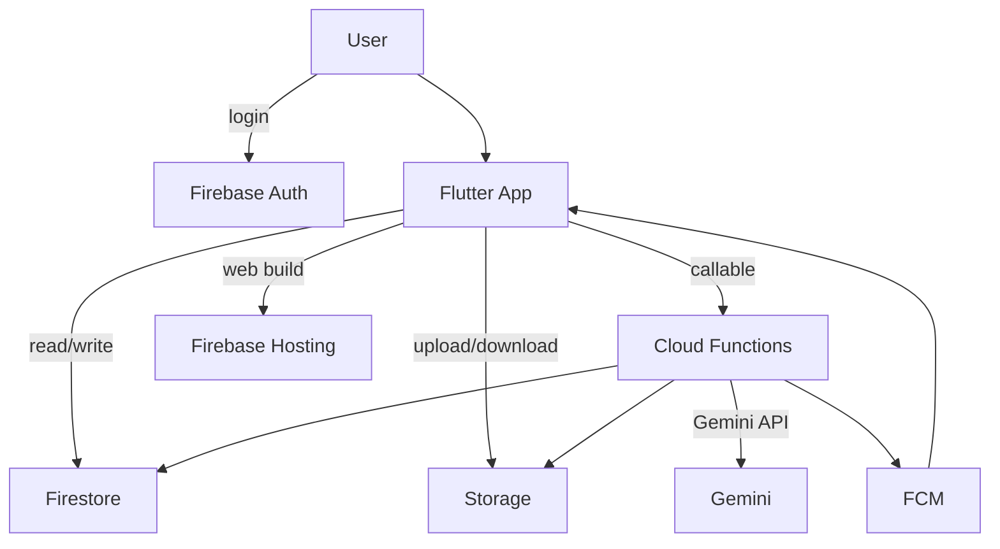
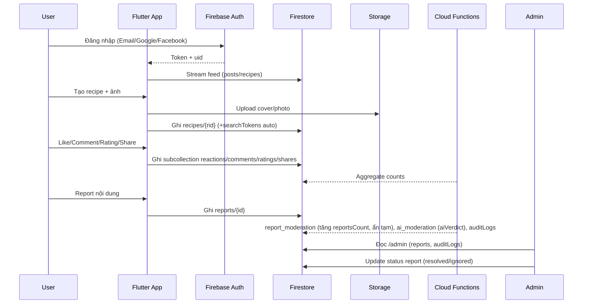
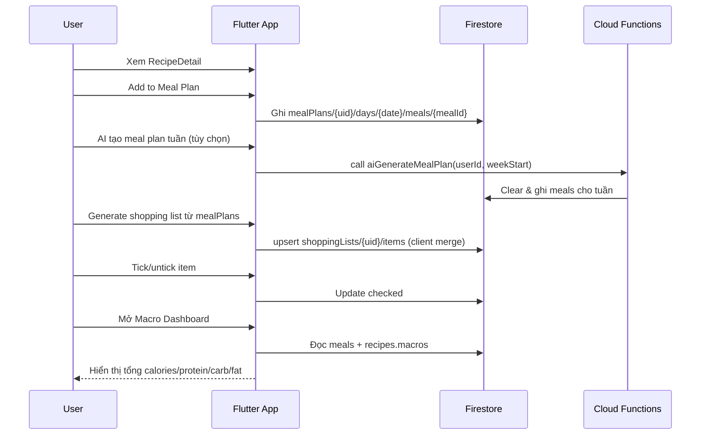

# Kiến trúc hệ thống

## 1. Tổng quan

- Client: Flutter (Android + Web) với Riverpod + GoRouter. Lớp `presentation` → `application` (controller/service) → `data` (repository).
- Backend: Firebase Auth, Firestore, Storage, Cloud Functions (Gemini + logic), FCM, Hosting (web).
- Realtime: Firestore stream cho feed, chat, planner, shopping list, notifications.

## 2. Luồng nghiệp vụ chính

### Luồng 1: MXH (Login → Feed → Create Recipe → Like/Comment → Report → Admin xử lý → AuditLogs)

### Luồng 2: Planner → Shopping List → Macro Dashboard

## 3. Module Flutter (`lib/features/*`)

- auth: đăng nhập, đăng ký, đồng bộ profile user (`users/{uid}`).
- feed: render post/recipe card stream, pagination.
- post: tạo/sửa/xóa post, upload ảnh, like/comment/share.
- recipe: tạo/sửa/xóa recipe, upload ảnh, rating/bookmark, detail page.
- recipes: danh sách recipe (grid/list, summary).
- search: tìm kiếm theo token/tag, có AI search parser (Functions).
- chat: DM/group, typing, read receipt, trigger Functions createDM/createGroup.
- planner: quản lý mealPlans, AI generate meal plan, generate shopping list.
- shopping: CRUD shoppingLists items, tick/untick, clear checked.
- nutrition: macro calculator/dashboard đọc recipes.macros + estimatedMacros từ mealPlans.
- report: gửi report; admin module đọc & xử lý.
- admin: màn hình báo cáo, audit logs, user/content moderation.
- leaderboard: hiển thị top tuần/tháng (Firestore `leaderboards/{period}`).
- notifications: FCM + Firestore `notifications/{uid}/items`.
- core/app: router, theme, analytics, common widgets; data layer sử dụng repository pattern (Firestore/Functions/Storage adapters).
- backend: `functions/src/*` (search_tokens, aggregates, ai_*, chat, leaderboard, report_moderation, planner_notifs/social_notifs).

Phụ thuộc: UI → controller/service (application) → repository (data) → Firebase SDK / Cloud Functions. State quản lý bằng Riverpod, điều hướng bằng GoRouter.

